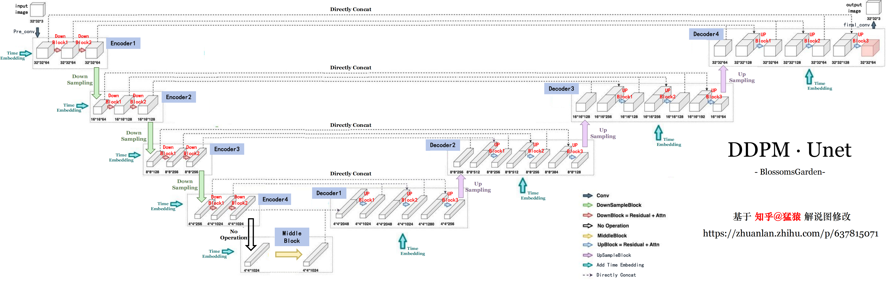
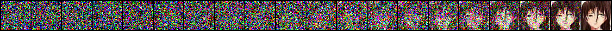
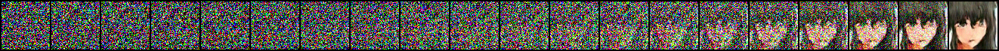
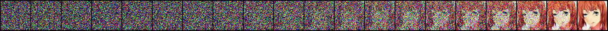
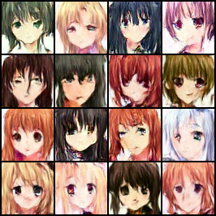
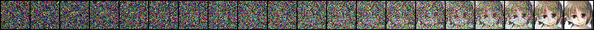
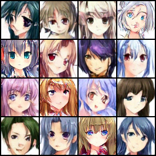
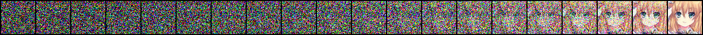
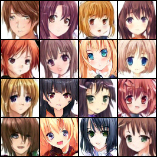

# 👋 Welcome!

约 600 行代码，从零开始做一个生成二次元女孩头像的生成式模型！

原 DDPM 论文的开源代码是tensorflow库实现的，但是tf环境太复杂了还有v1v2兼容性问题，突发奇想要不使用 PyTorch 复现 DDPM 代码？虽然网上已经有前人开辟好了道路，但一直没有时间付诸实践，不如刚好趁考研结束的几个月将这条路走完？


# 🔧 准备工作

### 数据集 (Kaggle是神)
- [Anime Faces](https://www.kaggle.com/datasets/soumikrakshit/anime-faces) 21551 张，64*64 像素，存在少数非头像、失真、重复图片
- [Anime Face Dataset](https://www.kaggle.com/datasets/splcher/animefacedataset/data) 63632 张，正方形，大小不统一

### 论文
- [Denoising Diffusion Probabilistic Models](https://dl.acm.org/doi/abs/10.5555/3495724.3496298) (2020)
- [Attention is All You Need](https://dl.acm.org/doi/10.5555/3295222.3295349) (2017)

### 源码
- [官方 diffusion_tf](https://github.com/hojonathanho/diffusion)
- [民间 diffusion_torch](https://github.com/labmlai/annotated_deep_learning_paper_implementations/blob/master/labml_nn/diffusion/ddpm)

### 解说
- [模型架构（文章）](https://zhuanlan.zhihu.com/p/637815071)
- [源码解读（文章）](https://zhuanlan.zhihu.com/p/655568910)


# 👨‍💻 Attention

DDPM 论文给出的源码中注意力机制非必须，而且实现方式与擎天柱(Transformer)一样。学习路径如下。但感觉还是太抽象了，用数据预测的例子很好理解，即能让预测值更接近样本的空间分布状况，但要是放在 LLM 或者 DDPM 里，脑子一下子迁移不过来

- [学术性介绍](https://www.bilibili.com/video/BV1TZ421j7Ke)
- [通俗易懂介绍](https://www.bilibili.com/video/BV1dt4y1J7ov) （注意评论区置顶）
- [沐神介绍与简单代码](https://www.bilibili.com/video/BV1264y1i7R1) 


# 💿 DDPM·Unet 架构

以[知乎@猛猿]()大佬的解说图为基础，修改了原图的位置、做出了新的标注，使得本仓库中 `unet.py` 文件中的 模型相关类、图像通道数 等信息都可以在图中找到对应，方便理解



相应地，本项目 unet 网络中的 Encoder 和 Decoder 直接使用 nn.Sequential(...) 铺展开的形式实现，更为直观。

    self.encoder=nn.Sequential(
        # 1st Encoder
        DownBlock(in_channels=64, out_channels=64, time_channels=256, attention=False),
        DownBlock(in_channels=64, out_channels=64, time_channels=256, attention=False),
        
        Downsample(n_channels=64),

        # 2nd Encoder
        DownBlock(in_channels=64, out_channels=128, time_channels=256, attention=False), 
        DownBlock(in_channels=128, out_channels=128, time_channels=256, attention=False),
        
        Downsample(n_channels=128),

        # 3rd Encoder
        DownBlock(in_channels=128, out_channels=256, time_channels=256, attention=True),
        DownBlock(in_channels=256, out_channels=256, time_channels=256, attention=True),
        
        Downsample(n_channels=256),
        # 4th Encoder

        DownBlock(in_channels=256, out_channels=1024, time_channels=256, attention=True),
        DownBlock(in_channels=1024, out_channels=1024, time_channels=256, attention=True)
    )


# 💡 训练配置

### 数据集

两个数据集合并后，人工删除了部分与头像无关的图片（如只有衣服、头发等等瑕疵图片），确保数据质量，共 78,698 张，所有图片均为 PNG 格式。自定义 MyAnimeDataset 类加载数据集，读取时加了随机水平翻转。其中 __getItem__() 方法中索引图片的方式如下：
    
    img_name = os.path.join(self.dataset_dir, f"{idx + 1}.png") 

因此要求数据集命名必须是 1.png, 2.png, ..., 依次递增（基于 `util.py` 中的 handle2dataset 函数实现）


### 训练参数

 - `batch_size:` 64
 - `learning_rate:` 1e-5
 - `optimizer:` Adams
 - `num_steps:` 1000 (Sample 时也要相应地降噪 1000 步才能出效果，少了全是噪声，多了会报错)
 - `epochs:` 50


### 项目架构
 - `unet.py:` unet 网络的实现
 - `train.py:` 包括：1.数据集预处理 -> 2.数据集加载 -> 3.DDPM模型(调用Unet模块) -> 4.Training (Algorithm1) 和 Sampling (Alogrithm2) -> 5.设置参数开训
 - `util.py:` 2 个工具函数，用于合并 2 个开源数据集、新建空文件夹
 - `eval.py:` 包括加载模型采样

 - `train.sh:` 训练启动脚本，若正在训练则停止并重启，若未开始训练则直接启动
 - `nohup.out:` 训练输出，损失值可供参考
 - `ddpm-model-45.ckpt:` 训练 45 epoch 的模型。在 `eval.py` 中改改 torch.load() 路径加载后直接 `python eval.py` 启动看看效果


### 启动
 - 训练： `sh train.sh`

每10轮保存一次模型，同时对16张噪声图进行 1000 步降噪检验效果。单图片降噪过程保存为 1.png ~ 16.png， 16张图片的最终结果展示保存为 16-imgs-final.png。

 - 验证： `python eval.py` 

改好里面的模型路径，直接 python eval.py 即可。


# 💊 炼丹结果

租用 RTX4090/40G，1 epoch 约 4min，共 50 个 epoch。前 2 个 loss 直接 0.2023 -> 0.0597，约 45 轮收敛，loss 稳定在 0.0163 附近。其中 DDPM.unet() 约 300w 参数，将 DDPM 整个保存下来 644MB。

### 未收敛时采样1000步（9 epoch）







### 未收敛时采样1000步（27 epoch）





### 收敛后采样1000步（45epoch）








# 🤯 踩坑

1. 实例化 Unet 一定要 to(device)，否则默认权重是 cpu 导致 device 冲突

    ```python
    unet = Unet().to(device)
    ```

2. 模型传参写好类型，步长 t 什么时候是 int 什么时候是 Tensor 一目了然

    ```python
    def diffuse(self, x0: torch.Tensor, t:torch.Tensor, noise=None):
    ```

3. 一定要记得 Sampling 时传入 unet 的步长依次是 t-1, t-2, …, 1, 0（不过如果直接 reverse(range(t)) 会导致 tqdm 进度条失效，因此在循环内做处理）

    ```python
    for _t in tqdm(range(t), desc=prompt, ncols=100):
        current_step = t - _t - 1   # 当前时间步 (t-1 到 0)
    ```