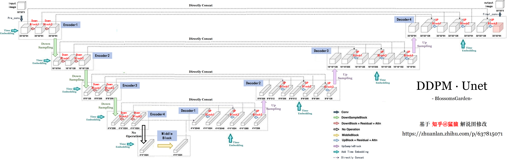

# 👋 Welcome!

约600行代码，从零开始做一个可以生成二次元女孩头像的生成式模型！

原 DDPM 论文的开源代码是tensorflow库实现的，但是tf环境太复杂了还有v1v2兼容性问题，突发奇想要不使用 PyTorch 复现 DDPM 代码？虽然网上已经有前人开辟好了道路，但一直没有时间付诸实践，趁考研结束的几个月将这个走这个过程走圆满吧！

# 🔧 准备工作

数据集 (Kaggle是神)
- [Anime Faces](https://www.kaggle.com/datasets/soumikrakshit/anime-faces) 21551 张，64*64 像素
- [Anime Face Dataset](https://www.kaggle.com/datasets/splcher/animefacedataset/data) 63632 张，正方形，大小不统一

论文
- [Denoising Diffusion Probabilistic Models](https://dl.acm.org/doi/abs/10.5555/3495724.3496298) (2020)
- [Attention is All You Need](https://dl.acm.org/doi/10.5555/3295222.3295349) (2017)

源码
- [官方 diffusion_tf](https://github.com/hojonathanho/diffusion)
- [民间 diffusion_torch](https://github.com/labmlai/annotated_deep_learning_paper_implementations/blob/master/labml_nn/diffusion/ddpm)

解说
- [模型架构（文章）](https://zhuanlan.zhihu.com/p/637815071)
- [源码解读（文章）](https://zhuanlan.zhihu.com/p/655568910)

# 👨‍💻 Attention 模块

DDPM 论文给出的源码中注意力机制非必须，而且实现方式与擎天柱(Transformer)一样。学习路径（视频）如下，但感觉还是太抽象了，用数据预测的例子很好理解，即能让预测值更接近样本的空间分布状况，但你要是放在 LLM 或者 DDPM 里，脑子一下子迁移不过来

- [学术性介绍](https://www.bilibili.com/video/BV1TZ421j7Ke)
- [通俗易懂介绍](https://www.bilibili.com/video/BV1dt4y1J7ov) （注意评论区置顶）
- [沐神介绍与简单代码](https://www.bilibili.com/video/BV1264y1i7R1) 

# 💿 DDPM·Unet 架构

以[知乎@猛猿]()大佬的解说图为基础，修改了原图的位置、做出了新的标注，使得本仓库中 main.py 文件中的 模型相关类、图像通道数 等信息都可以在图中找到对应，方便理解

# 💊 训(炼)练(丹)配置

 图片格式为 64*64，RGB三通道；batch_size 为 64；采用 Adams 优化器，学习率为2e-5；训练 100 epochs (租用 RTX4090/40G 一个epoch约6min)，DDPM 模型采样步长 1000 步
 - Unet.py 中有且只有 Unet 网络的实现
 - train.py 包括从1.数据预处理 -> 2.Dataset和DataLoader加载数据集 -> 3.DDPM模型(调用了Unet模块) -> 4.定义训练与验证函数 -> 5.开训(每20轮保存一次模型，保存的同时进行采样看看效果)
 - eval.py 只包括加载模型采样
 - AnimeFaces64.zip 中存放2个开源数据集合并后的结果。删除了所有大小不足64*64的图片、人工删除了衣服、黑暗图片等瑕疵结果。由于Dataset.__getItem__() 类中定义的索引方式是从1.png开始逐级往后，因此数据集应保证从1开始依次往后命名且为png格式图片。

 

# 💡 炼丹中...
